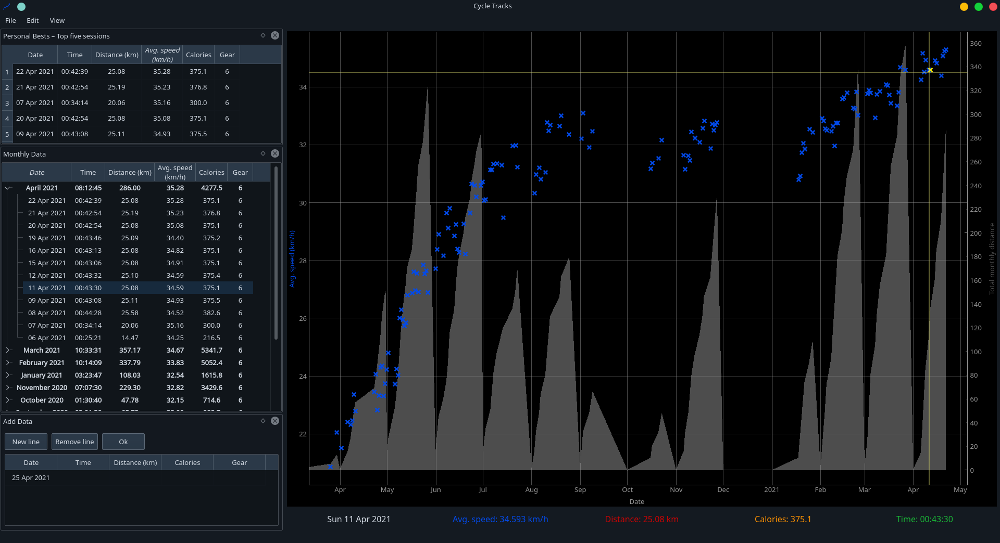

# cycleTracks

New and improved version of [MyCycle](https://github.com/keziah55/MyCycle).

This GUI centres on the plotting, and uses PyQtGraph to create interactive
plots of my cycling stats.

## Features

- Interactive plot

- Highlights value under mouse and shows stats of that point in label under plot

- Tree widget showing data, split by month, with a summary of each months total/best values

- Click on labels under plot to switch data series plotted

- Double click on month on plot x-axis to zoom in on that month

- Click on point to select that point in the data viewer

- 'Personal bests' widget shows the top five sessions

### To do

- Compare multiple points

## Requirements

- [NumPy](https://numpy.org/)
- [Pandas](https://pandas.pydata.org/)
- [PyQt5](https://pypi.org/project/PyQt5/)
- [PyQtGraph](https://pypi.org/project/pyqtgraph/) >= 0.11.0
