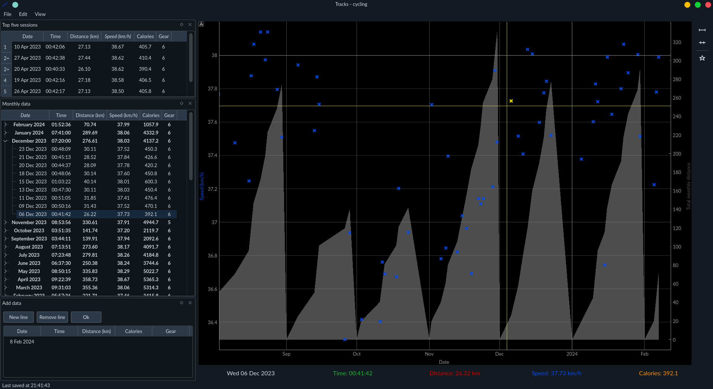

# Tracks

A GUI to track and plot exercise data.

A simple user guide can be found [here](https://keziah55.github.io/tracks/).

## Features

- Interactive plot

- Highlights value under mouse and shows stats of that point in label under plot

- Tree widget showing data, split by month, with a summary of each months total/best values

- Click on labels under plot to switch data series plotted

- Double click on month on plot x-axis to zoom in on that month

- Click on point to select that point in the data viewer

- 'Personal bests' widget shows the top five sessions

## Installing

Install the [requirements](#requirements), e.g. with `pip`: `python -m pip install -r requirements`.
Then simply `python main.py` to run the Tracks GUI.

### Requirements

- [NumPy](https://numpy.org/)
- [Polars](https://pypi.org/project/polars/)
- [QtPy](https://pypi.org/project/QtPy/)
- Any of: [PyQt5](https://pypi.org/project/PyQt5/), [PySide2](https://doc.qt.io/qtforpython-5/index.html), [PyQt6](https://pypi.org/project/PyQt6/), [PySide6](https://doc.qt.io/qtforpython-6/index.html)
- [PyQtGraph](https://pypi.org/project/pyqtgraph/)
- [customQObjects](https://github.com/keziah55/CustomPyQtObjects)
